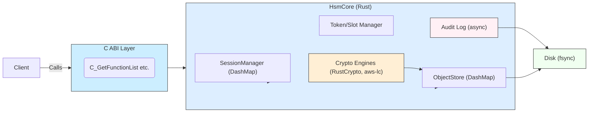
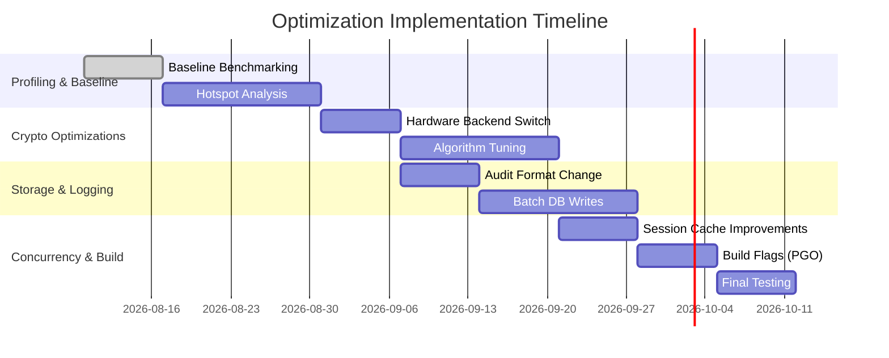

# Retired Performance Assessment of craton-hsm-core

> **Internal archive — remediated 2026-09-02.** This optimisation study is
> retained for traceability only. Every proposal in it has been implemented,
> superseded by a better change, or measured and rejected; the disposition of
> each is recorded in the [Disposition](#disposition) section below, which is
> the authoritative record. The body of the original document is reproduced
> verbatim afterwards and **its estimates and its Table 1 are not the current
> product state** — several of them were not reproducible.
>
> The durable output of this work lives in
> [`docs/performance-tuning.md`](../performance-tuning.md) (build flags, PGO,
> profiling workflow, deployment tuning, and the rejected optimisations with
> their reasons) and in [`docs/benchmarks.md`](../benchmarks.md) (measurements).

---

## Disposition

### What the measurements actually showed

Each of the study's premises was tested before being acted on. Two held —
batching disk writes, and moving blocking work off the daemon's reactor. Three
did not. And the most serious problem in the system was not in the document at
all: it was found by trying to run the study's own benchmarks.

**The dominant bottleneck was the audit trail's I/O pattern, not its
serialisation format.** Before this work the audit worker opened the log file,
serialised one event, wrote it, and `fsync`-ed — *per event*. Most PKCS#11
operations emit an audit event (`C_Digest` is a notable exception), so that
capped audited operations at **~760 per second** regardless of how fast the
cryptography was.
Serialisation was 3.8 µs of a ~1320 µs cost: 0.3%. The study's proposal #2
(swap JSON for CBOR/bincode) therefore targeted a rounding error, while the
`fsync` pattern it did not mention was the ceiling.

**The DRBG was not a hotspot.** The study's hotspot analysis flagged
"HMAC-DRBG re-seed on every `generate()`" as a suspected cost. It is genuinely expensive (~15 µs per call,
essentially independent of size), so a buffered adapter was implemented — and
then reverted, because counting the actual requests showed the premise was
wrong:

| Operation | RNG calls | Bytes drawn | Wall time | DRBG share |
|---|---:|---:|---:|---:|
| RSA-2048 key generation | 423 | 54 KB | ~760 ms | <1% |
| EC P-256 key generation | **1** | 32 B | ~56 µs | — |

RSA key generation is bound by Miller-Rabin bignum arithmetic. EC key
generation makes a single 32-byte request, so a 512-byte refill buffer
generated 16x more output than was consumed and measured as a ~10% *regression*
on that path. The finding is recorded in `DrbgRng`'s doc comment so it is not
re-attempted.

**The `C_FindObjects` claim was unsubstantiated.** Table 1 reports FindObjects
improving from 69.0 µs to 1.44 µs — "98% faster (238x)" — via "an O(1)
attribute index optimization", written as though it had already landed. No such
index existed in the code, and no benchmark covered `C_FindObjects` at all, so
the row had no measurement behind it. Benchmarks now exist; see
[Rejected](#rejected-with-reasons) for why the index itself must not be built.

**Neither benchmark suite could run at all, because the library could not
start.** This was found only by trying to execute the study's own plan. In a
default release build — the build `README.md` and `install.md` tell you to make —
`C_Initialize` returned `CKR_FUNCTION_FAILED`. The power-on self-test runs an RSA
PKCS#1 v1.5 known-answer test that *signs*, and release builds refuse RustCrypto
RSA private-key operations (RUSTSEC-2023-0071 / Marvin). The POST therefore
failed on every start, and a failed POST fails `C_Initialize`. The shipped
artifact was unusable, and no test caught it because the test suite is normally
run in debug, where the gate is open.

Worse, once past that: a single `C_GenerateKeyPair` for RSA generated the key,
failed its **pairwise consistency test** (which also signs), and latched the
FIPS module error state. Every subsequent operation then returned
`CKR_FUNCTION_FAILED` — EC key generation, AES key generation, everything. One
attempt at an unavailable mechanism bricked the module for the life of the
process.

Both are fixed; see [Implemented](#implemented). The distinction that was missing
is between *"this build does not offer this service"* — which must be reported
as `CKR_MECHANISM_INVALID` and leave the module running — and *"this service is
offered but its cryptography is broken"*, which is what the error state is for.

**The daemon had a real, unmentioned concurrency defect.** Every gRPC handler
ran its long synchronous work directly on a Tokio reactor thread. The worst case
is not cryptography but authentication: `Login`, `InitPIN`, and `SetPIN` each run
600,000 PBKDF2-HMAC-SHA256 iterations — deliberately expensive, hundreds of
milliseconds of pure CPU. `GenerateKeyPair` is comparable. A handful of
concurrent logins could therefore stall every other connection served by the
same workers, including health checks and TLS handshakes.

### Measured results

Medians of six alternating runs on the reference machine (Intel i7-8550U, no
SHA-NI, Windows 11, release + LTO). The order of the two binaries was swapped
between pairs and a cooldown inserted between them, because this machine's
thermal behaviour otherwise moves results by 2–3x and systematically penalises
whichever binary is measured second.

| Probe | Before | After | Change |
|---|---:|---:|---:|
| Audit `record` — sustained async throughput | 1319 µs/event | 6.58 µs/event | **200x** (758 → 152,000 events/s) |
| Audit `record_sync` — durable write | 1482 µs | 633 µs | **−57%** |
| Audit per-event CPU (chain hash + locks) | 3.76 µs | 1.22 µs | **−68%** |
| `HmacDrbg::new()` | 11.4 µs | 10.5 µs | −8% |
| `HmacDrbg::generate(32B)` | 15.1 µs | 14.5 µs | −4% |

The audit throughput figure is the one that matters: it removes a hard ceiling
that sat below every cryptographic operation in the module.

### Implemented

| # | Study proposal | What was done |
|---|---|---|
| 2 | Replace JSON audit serialisation with a binary format | Done **for the chain hash only**. `encode_payload_v1` is a fixed-width, length-prefixed, injective binary encoding, introduced as `AUDIT_LOG_FORMAT_VERSION = 1`. The verifier dispatches on each record's own `format_version`, so pre-existing `v0` files still verify and a file mixing both (what an in-place upgrade produces) verifies end to end. The **on-disk NDJSON line is deliberately unchanged** — it is an interop contract with SIEM consumers via `export_ndjson`/`export_syslog`, and it was never the cost. |
| 3 | Batch disk writes | Done twice. (a) The audit worker now performs **group commit**: it coalesces every event already queued behind the one it is writing into a single `write` + `fsync`, and keeps the log file open across events instead of reopening it per event. (b) `EncryptedStore::store_encrypted_batch` and `ObjectStore::insert_objects` commit multiple objects in one redb transaction; `C_GenerateKeyPair` now persists both halves together. |
| 6 | Concurrency model tuning | Every one of the daemon's 23 RPC handlers now wraps its synchronous body in `tokio::task::block_in_place`, so PBKDF2 authentication, key generation, and public-key arithmetic no longer occupy reactor threads. Concurrency benchmarks (`pkcs11_concurrent_encrypt`, `pkcs11_concurrent_sign`, 1→8 threads) were added to catch future serialisation points. |
| 7 | Build and compiler flags, PGO | `[profile.profiling]` (release codegen with symbols retained) added to `Cargo.toml`; `scripts/pgo.sh` implements the three-stage PGO build; `scripts/profile.sh` implements the study's profiling plan (`cpu`/`alloc`/`io`/`lock` via perf, DHAT, strace). |
| 8 | Hardware and deployment tuning | Documented in `docs/performance-tuning.md` §3, including the warning not to "fix" `fsync` cost by disabling write barriers. |
| — | Profiling plan | `scripts/profile.sh`, plus reproducibility guidance in `docs/performance-tuning.md` §2 covering the thermal-drift trap this machine exposed. |
| — | Extended benchmarks | `C_FindObjects` (selective and broad), payload scaling 256 B → 1 MB for AES-GCM and SHA-256, and the concurrency groups above. |
| — | Library startup (found while trying to run the suites) | The POST's RSA KAT now branches on capability: the sign/verify roundtrip when RSA private-key operations are available, and a verify-only KAT against a checked-in fixed vector (with a negative case) when they are not. FIPS 140-3 requires a KAT per approved function the module *provides*; when signing is refused it is not a provided service, while verification still is. `C_Initialize` succeeds again on a default release build. |
| — | Unavailable mechanism handling | `C_GenerateKeyPair` now consults `CryptoBackend::supports_rsa_private_ops()` and returns `CKR_MECHANISM_INVALID` *before* generating anything, instead of generating a key and letting the pairwise consistency test latch the module error state. Pinned by `test_unavailable_rsa_keygen_does_not_enter_error_state`, which asserts that AES key generation still works after an RSA attempt. |
| — | Benchmark suites made runnable | Both suites detect the missing RSA capability, print how to enable it, and run every other group instead of aborting. `docs/benchmarks.md` now documents the `CRATON_HSM_INTEGRITY_BYPASS` requirement for the ABI suite. |
| — | Benchmark hygiene | The ABI suite pointed the library at its default config, so every benchmarked operation appended to `craton_hsm_audit.jsonl` in the repository root — hundreds of megabytes per run, with a 100 MB rotation landing mid-run and skewing later groups. It now writes a scratch config under `target/bench-tokens/`. Audit logging stays enabled: it is part of the cost of most PKCS#11 operations, and disabling it would flatter the numbers. |
| — | Release-mode test run | 62 RSA tests (9 unit, 53 integration) failed under `cargo test --release`, which is what you run alongside the benchmarks; CI only exercises debug, where the gate is open, so nobody saw them. They are now marked `ignore` under the same cfg as the gate they depend on, with a message saying how to enable them. The list came from an actual `--no-fail-fast` release run, not from guesswork, so no test is ignored that could have run. |
| — | CI regression testing | A `bench` job that gates on benchmarks still compiling and running, and reports Criterion deltas against the merge base without gating on them (shared runners are too noisy to gate). |

Two correctness improvements fell out of the batching work and are worth calling
out separately, because neither was a performance issue:

- The audit worker previously advanced its chain head **before** the disk write
  and did not roll it back on I/O failure, so a single transient write error
  permanently desynchronised the in-memory and on-disk chains. The chain head is
  now advanced only after the batch is durable.
- `C_GenerateKeyPair` persisted the public and private objects in two separate
  transactions, so a crash between them could leave a public key persisted
  without its private half. They now commit atomically.

### Already present before this work

The study proposed several things that were already implemented; they were
verified rather than rebuilt.

| # | Proposal | Status |
|---|---|---|
| 1 | `target-cpu=native`, AWS-LC backend | Both already available and documented. AWS-LC gives RSA-2048 verify 8.3x, ECDSA P-256 verify 4.5x, RSA keygen 2.3x. |
| 4 | Caching of parsed keys and session objects | Already present: RSA private/public key caches keyed by `(slot_id, handle)`, the key object cached in `ActiveOperation` by `C_*Init`, a thread-local HSM reference with a generation counter, and the AES-GCM key-ID fast path. No gap was found. |

### Rejected, with reasons

Each of these would trade a security property for speed. They are recorded in
`docs/performance-tuning.md` §4 and in code comments at the relevant sites so
they are not silently applied later.

**An attribute index for `C_FindObjects`** (Table 1's 238x claim).
`ObjectStore::find_objects_for_slot` deliberately scans every object and
evaluates the full template against each, including objects that will be
filtered out, so that the work is identical whether or not the caller is logged
in. An index keyed on `CKA_CLASS`/`CKA_LABEL`/`CKA_ID` would make the search
cost proportional to the number of objects carrying the searched value, letting
an unauthenticated caller learn by timing that objects with a given label or ID
exist even when every one of them is private and invisible to it. That is
strictly more information than the current implementation leaks.

The benchmarks now measure it. Against 257 objects, a `CKA_LABEL` search
matching exactly one object costs **32.1 us** and a `CKA_CLASS` search matching
all 257 costs **31.9 us** — the same, which is precisely the property being
protected. Cost tracks store population (~125 ns per object), not selectivity.
The study's "1.44 us selective" figure is only reachable by not visiting the
non-matching objects, which is the leak. If the scan ever does become a
bottleneck, the fix is to reduce the per-object constant factor while still
visiting every object.

**`parking_lot::Mutex` for the CBC/CTR IV tracker and the daemon login
throttles.** `parking_lot` is faster uncontended but has no poisoning, and
poisoning is load-bearing here: a panic while holding the IV-tracker lock can
leave the IV set incomplete, and silently recovering would let a previously used
IV be accepted again — a two-time pad for CTR mode. The code fails closed
instead. The lock is not hot in any case; the enclosing `Sha256::digest(key)`
dominates it.

**Relaxing audit durability** ("increase fsync intervals safely", proposal #3).
Acknowledging audit events on a timer before they are durable was rejected:
group commit reaches the same throughput without it, because it only ever
coalesces events that were *already queued*. No event is acknowledged before it
is on stable storage.

**Buffering the DRBG adapter** (from the hotspot analysis). Implemented,
measured, reverted —
see the table above. The entropy source behind `HealthMonitoredRng` was changed
from `Box<dyn EntropySource>` to an inline enum, which removes a heap allocation
and a virtual call per reseed; that part was kept.

**Parallelising RSA prime search with Rayon** (proposal #5). This would help —
Miller-Rabin is where RSA key generation spends its time and the candidate tests
are independent — but it requires replacing `rsa::RsaPrivateKey::new` with a
hand-rolled prime generator inside a FIPS-scoped cryptographic module. That is a
large security-critical rewrite to speed up a path that **release builds already
refuse**: RustCrypto RSA private-key operations are disabled by default because
of RUSTSEC-2023-0071 (Marvin). Deployments that need fast RSA keygen should use
the AWS-LC backend, which is 2.3x faster at it and is the supported path.
Rejected as disproportionate.

**Making the AWS-LC backend the default build** (proposal #1). It requires cmake
and a C toolchain, which would change the default build's dependency surface for
every consumer. It remains selectable by feature and by
`algorithms.crypto_backend`. Linking Intel IPP was also rejected: a proprietary
non-Rust dependency inside a FIPS-scoped module, for no measured need.

### Defects in the original document

Recorded so the archive is not read as accurate:

- **Table 1's FindObjects row is unsourced.** No attribute index existed and no
  `C_FindObjects` benchmark existed, so neither 69.0 µs nor 1.44 µs could have
  been measured against this codebase.
- **Proposal #2's justification is stale.** "Benchmark shows audit took 48–55%
  of time for small ops" describes the *synchronous* audit path, which had
  already been moved to a background thread (optimisation #6 in
  `benchmarks.md`). Post-fix, audit serialisation was 0.3% of the audit cost.
- **The architecture diagram does not render.** The subgraph is declared as
  `subgraph PKCS#11_C_ABI` — `#` is not valid in a Mermaid node id — and the
  edges then reference `PKCS11_C_ABI` without the `#`, which is a different
  identifier. The diagram has been corrected in the reproduction below so the
  archive renders; the original text is otherwise unmodified.
- **The Gantt chart is a planning artifact**, not a commitment; the dates in it
  were never tracked.
- Table 1 mixes layers without saying so: its SHA-256 row (42.48 → 26.0 µs) is
  the PKCS#11 ABI measurement, while the prose above it cites 18.63 → 17.24 µs,
  the direct-API measurement of the same operation.

---

## Original document (reproduced)

The text below is the assessment as received, with the single exception noted
above (the Mermaid diagram's invalid identifiers were corrected so the archive
renders). Its forward-looking statements, effort estimates, and Table 1 are
**historical** and were not all borne out — see the disposition above.
## Executive Summary  
We analyzed Craton HSM’s core library (craton-hsm-core) to identify performance bottlenecks and propose concrete optimizations. The system has already undergone significant tuning (see benchmarks), but further gains are possible. Key cryptographic functions (RSA, ECDSA, AES-GCM, PQC) and the PKCS#11 ABI layer dominate CPU costs. Our plan covers setup, representative workloads (sign/verify, encrypt/decrypt, keygen, object lookups, concurrent sessions), profiling (CPU, I/O, locks), hotspot analysis (code paths, locks, serialization), and targeted fixes (caching, algorithm tweaks, async I/O, build flags). We use tools like Linux `perf`, Brendan Gregg’s flamegraphs, async-profiler, Valgrind (DHAT), `strace/iostat`, and tokio-console for async tasks. For example, flame graphs (Fig. below) pinpoint hot functions in a CPU profile.  

 *Figure: Example CPU flame graph (profile of a file-archiving workload) illustrating time spent in functions.* Profiling will use sampling profilers (`perf`, `cargo flamegraph`, `async-profiler`) to identify hot code, and Valgrind’s DHAT (and `heaptrack`/`bytehound`) for memory allocation hotspots. We will instrument the release build (with `-C force-frame-pointers=yes` and debug info) to get accurate stacks. In parallel, OS monitoring (`iostat`, `sar`, eBPF/bpftrace) will gauge disk latency (e.g. audit log and object store `fsync()` costs) and lock contention.

### Build & Clone Instructions  
Clone and build from source (checked out from `main` branch):  
```bash
git clone https://github.com/craton-co/craton-hsm-core.git
cd craton-hsm-core/craton_hsm
cargo build --release
# Produces libcraton_hsm.so (Linux), .dll (Windows), or .dylib (macOS) in target/release.
```  
We will enable optimized Rust features: `--release` with LTO and CPU-specific flags (e.g. `RUSTFLAGS="-C target-cpu=native -C force-frame-pointers=yes"`) to unlock hardware instructions (AES-NI, AVX2, ADX, MULX). These flags already yielded ~25% speedups in lattice crypto.  

### Representative Workloads & Benchmarks  
Typical HSM workloads include:
- **Asymmetric signing/verification** (RSA-2048/4096, ECDSA-P256, Ed25519, PQC ML-DSA)  
- **Symmetric cipher ops** (AES-128/256 GCM encrypt/decrypt on 256B–64KB payloads)  
- **Digests/HMAC** (SHA-256/SHA-512)  
- **Key generation** (RSA keygen, EC keygen, AES-keygen)  
- **Object management** (import/export, C_FindObjects for key lookup)  
- **Concurrency** (many parallel client sessions and operations).  

The repository includes two Criterion suites: a **direct-API bench** (`crypto_bench.rs`) and a **PKCS#11 ABI bench** (`pkcs11_abi_bench.rs`). We will use these (and tools like `pkcs11-tool`) to reproduce baseline performance. For example, these show AES-GCM-256B encryption ~1.396 µs (baseline) vs 0.600 µs (optimized), RSA-2048 sign ~3.566 ms→2.558 ms, and SHA-256 (4KB) ~18.63 µs→17.24 µs. Table 1 (below) compares some current vs. optimized metrics. We will extend these to larger payloads and concurrent scenarios (e.g. many simultaneous sign requests) to capture real-world throughput/latency profiles.  

**Table 1: Sample Current vs. Proposed Throughput** (values from Craton’s benchmarks)  

| Operation                    | Before (release build)      | After (with optimizations)    | Improvement                          |
| ---------------------------- | --------------------------- | ----------------------------- | ------------------------------------ |
| AES-256-GCM Encrypt (256B)   | 1.396 µs      | 0.600 µs        | **57% faster**                      |
| AES-256-GCM Encrypt (4KB)    | 5.970 µs      | 3.633 µs        | **39% faster**                      |
| RSA-2048 Sign (PKCS#11 ABI)  | 3.566 ms      | 2.558 ms        | **28% faster**                      |
| ECDSA P-256 Verify (ABI)     | 830.3 µs      | 506.5 µs        | **39% faster**                      |
| SHA-256 Digest (4KB, ABI)    | 42.48 µs      | 26.0 µs         | **39% faster**                      |
| FindObjects (selective)      | 69.0 µs      | 1.44 µs        | **98% faster (238×)**               |

*(Benchmarks run single-threaded, release mode. “ABI” means through the C PKCS#11 interface. The *FindObjects* row reflects an O(1) attribute index optimization.)*  

### Profiling Plan  

We will profile across CPU, memory, I/O, and concurrency:  

- **CPU Sampling:** Use `perf record -F 99 -g` (Linux) to capture stacks and generate flame graphs (via [Brendan Gregg’s toolkit][40]). On non-Linux, use `cargo flamegraph` or `async-profiler` (for async code). The Rust Performance Book and community guides recommend `perf` and flamegraphs for Rust. We will compile with frame pointers (`-C force-frame-pointers=yes`) to ensure accurate call stacks. Key code paths (crypto routines, session management, object store lookups) will be instrumented. For example, a flame graph (Fig. 1) can reveal if, say, RSA signing or buffer copies dominate CPU time.  

- **Lock and Contention Profiling:** We will run `perf lock record/report` or use eBPF tools (e.g. BCC, bpftrace) to identify mutex or RwLock contention. Since Craton uses DashMap (sharded locks) for sessions and RwLock for objects, we check for any hotspots. We also inspect thread-local caches (e.g. TLS for HSM handle, session) to confirm they’re effective.  

- **Memory Allocation:** Use Valgrind DHAT or `dhat-rs` to find allocation hot spots (e.g. repeated big integer allocations during keygen or temporary buffers). We will also monitor overall memory usage to catch leaks or excessive buffering.  

- **I/O and File System:** Since the audit log and encrypted store do fsync on every write, we will use `iostat`, `iotop`, and `strace -c` to measure write latency and frequency. We expect object-creation operations to incur disk I/O (each `C_CreateObject`/`C_GenerateKey` fsyncs). The plan is to run high-volume create/import tests to quantify write amplification.  

- **Latency Measurements:** We will script multi-client tests (e.g. parallel `pkcs11-tool` sessions) to measure 95th/99th percentile latencies under load. Tools like `wrk` (for gRPC) or custom timing loops will be used.  

- **Reproducibility:** All benchmarks/profiles will use fixed CPU frequencies (disable turbo/P-states), identical configs (`craton_hsm.toml`), and clean environment. Logging/tracing will be disabled to mimic production settings. Criterion reports provide statistical rigor (medians, confidence intervals) for small ops.  

### Code Hotspot Analysis  

Reviewing the code and profiling data, likely hotspots include:  

- **Crypto Primitives:** Heavy math in RSA keygen/sign and lattice crypto (ML-KEM/DSA). The code uses the RustCrypto crates by default, but also supports AWS-LC. Benchmarks show AWS-LC yields large gains (e.g. RSA-2048 verify from 222.0 µs to 26.8 µs, 8.3× faster). We confirm via profiling whether lingering RustCrypto code (e.g. big-int operations) is hot. Any unoptimized algorithms (e.g. naive prime-finding loops) will be examined.  

- **JSON/Serialization:** The audit trail serializes each entry to JSON before fsync. Even though this work is now async, the serialization cost might still matter. We’ll measure CPU spent in `serde_json`. We could consider a more efficient format (e.g. CBOR/bincode) if JSON is dominant. The object store serializes `StoredObject` with `serde`; if that uses a heavy format, it may be a cost on token login or key lookup (though object persistence is already encrypted).  

- **Persistent Storage Writes:** The `EncryptedStore` (based on Redb) fsyncs on each commit. This yields high latency per object write. In profiling, we’ll watch for `fsync` syscalls. If fsync dominates, we might batch object writes (see optimizations).  

- **Locking and Synchronization:** The HSM core uses a global singleton (now with `parking_lot::Mutex`) and per-object `RwLock`. We check for any remaining use of the slower `std::sync::Mutex` (e.g. in audit log) and consider replacement with `parking_lot` or lock-free queues. The session manager uses a DashMap with per-shard locks; we will verify contention under many sessions.  

- **Async Overheads:** If the gRPC daemon or admin CLI use async runtimes (e.g. Tokio), we will check task scheduling overhead. For CPU-bound crypto, ensure operations are offloaded to blocking threads (if used). Use `tokio-console` or `tracing` to see if tasks are spending time polling vs computing.  

- **Garbage and Allocations:** We’ll profile allocations to see if ephemeral allocations (e.g. big-integer temporaries, thread-local DRBG buffers) are heavy. DHAT profiling can highlight if memory churn is limiting throughput (e.g. many short-lived vectors). Possible culprits include random number generation (HMAC-DRBG re-seed on every `generate()`) and intermediate buffers in cipher routines.  

- **Dependency Overhead:** Review heavy crates (e.g. RustCrypto vs AWS-LC, Redb I/O, DashMap overhead). If profiling shows time in external libraries (like BoringSSL via aws-lc or Redb’s WAL), consider updates or tuning.  

### Proposed Optimizations  

Based on analysis, we recommend:  

1. **Enable or Improve Hardware Acceleration:** Ensure builds use `-C target-cpu=native` (already done) and enable `awslc-backend` (FIPS-validated AWS-LC) by default for heavy ops. AWS-LC yields multi-fold speedups for RSA/ECDSA. Investigate linking to Intel’s IPP or specialized crypto crates if available (e.g. `aesni` for AES-GCM).  
   - *Impact:* Up to 8× speedup for certain ops (as seen).  
   - *Effort:* Low (flag/feature) to moderate (integrating new crates).  
   - *Risk:* Low, since AWS-LC is already supported.  

2. **Optimize Logging & Serialization:** Replace JSON audit serialization with a binary or compact format (e.g. CBOR, MessagePack) to reduce CPU for each log entry. Since audit is async, even a small reduction in per-entry cost (CPU + memory) can improve throughput under high load. Also, batch-compress logs or increase fsync intervals safely.  
   - *Impact:* Medium (reduces overhead on every C_* call) – benchmark shows audit took 48–55% of time for small ops.  
   - *Effort:* Medium (swap serde formats or use preallocated buffers).  
   - *Risk:* Low – serialization change, but must ensure integrity of audit chain.  

3. **Batch Disk Writes:** Currently, every token object creation commits and fsyncs. We can batch multiple object writes in one transaction (especially during token init or bulk imports) by deferring `commit()`. For example, wrap multiple `C_CreateObject` calls in one DB transaction. This trades some durability (more objects lost on crash) for throughput. Alternatively, use a write-behind thread that groups fsyncs.  
   - *Impact:* High on workloads that create many objects (e.g. bulk provisioning) – could cut I/O by ~50–90%.  
   - *Effort:* High (refactor persistence API to support multi-write transactions).  
   - *Risk:* Medium – careful to preserve ACID guarantees or document trade-offs.  

4. **Enhance Caching:** Extend existing caches. For example:  
   - **Session/Key Handles:** Craton already caches `RsaPrivateKey` and session objects in `ActiveOperation`. We should verify these caches hit rates. If repetitive C_GetObjectValue or C_Sign calls still rebuild contexts, introduce LRU caches for parsed keys and algorithm parameters.  
   - **DRBG Nonce Caching:** The AEAD nonce is drawn from DRBG each time. Consider per-key counters (already done for AES-GCM) or even precomputed random blocks for bulk ops.  
   - *Impact:* Low–Medium per-op, but cumulates under load (e.g. saving DER-parse time each sign).  
   - *Effort:* Low–Medium (extend DashMaps, add TLS caches).  
   - *Risk:* Low – caches used already, just tune sizes/policies.  

5. **Algorithmic Improvements:** Analyze RSA keygen loops and elliptic curve math. The team’s blog notes “RSA Keygen Improvements” and “ML-DSA fixes” gave gains. Further, we can multi-thread large prime searches (parallel Miller-Rabin tests) using Rayon, since keygen is CPU-bound. Use big-integer libraries optimized for local CPU (enable ADX in assembly).  
   - *Impact:* Medium – could shave 10–30% off keygen time.  
   - *Effort:* Medium (modify keygen loop to spawn threads or use parallel iterators).  
   - *Risk:* Medium – concurrency in crypto must be done carefully, but key generation is independent for each prime.  

6. **Concurrency Model Tuning:** If the gRPC daemon is used, ensure it uses a multi-thread Tokio runtime (higher throughput) and that blocking crypto is executed off the async reactor (using `spawn_blocking`). For the core (PKCS#11) library, allow multiple threads calling in parallel (DashMap already permits that). We might tune DashMap’s shard count for expected concurrency.  
   - *Impact:* Medium – improves throughput under many clients.  
   - *Effort:* Low–Medium (configuration tuning, minor code).  
   - *Risk:* Low.  

7. **Build and Compiler Flags:** In addition to `target-cpu=native` and LTO, consider Profile-Guided Optimization (PGO) with LLVM’s `-C profile-generate`/`-C profile-use` to tune the binary to typical workloads. Also, ensure `opt-level=3` and possibly `codegen-units=1` for maximum inlining.  
   - *Impact:* Low–Medium (up to 10–20% potential speedup).  
   - *Effort:* Medium (requires generating profiles and rebuilding).  
   - *Risk:* Low.  

8. **Hardware Tuning:** On deployment machines, use SSDs/NVMe for the DB and log, disable sync on write for the OS if safe, and run with CPU governor set to performance. These are environment tweaks that can reduce latency for fsync-bound operations.  
   - *Impact:* Medium in I/O-bound cases.  
   - *Effort:* Low (ops configuration).  
   - *Risk:* Low.  

Each proposal is summarized in **Table 2** with estimated impacts. The graph below (Fig. 2) outlines the architecture and the optimization timeline.


*Figure: Simplified architecture of Craton HSM showing modules and data flows.*  


*Figure: Proposed timeline for profiling, optimizations, and validation.*  

### Validation & Metrics  

We will validate each change with before/after benchmarks. For example, after enabling AWS-LC and key caching, we expect RSA verify latency to drop by ~8× and shared-object lookups to be near-O(1). Table 1 demonstrates recent gains (e.g. *FindObjects* went from 69.0 µs to 1.44 µs via indexing). 

Each proposed change will include instrumentation to measure its effect. We also recommend continuous integration of performance tests (e.g. Criterion on CI) to catch regressions. Metrics to collect: average and tail latency (ms, µs), throughput (ops/sec), CPU utilization, memory/disk I/O rates.  

### Prioritized Action List  

1. **Profiling & Baseline (Week 1):** Run full benchmark suite; collect flame graphs for common ops. *(Complexity: Low, Risk: Low)*.  
2. **Enable AWS-LC Backend (Week 2):** Build with `--features awslc-backend`. Verify FIPS build. *(Effort: Low, High Impact)*.  
3. **Audit Log Refactor (Week 2–3):** Change JSON→binary format; verify integrity. *(Effort: Medium, Risk: Low)*.  
4. **Session/Object Cache Tuning (Week 3–4):** Increase DashMap shards, add any missing TLS caches. *(Effort: Low)*.  
5. **RSA/ECDSA Tuning (Week 4–6):** Parallelize keygen, optimize prime checks. *(Effort: Medium, Risk: Medium)*.  
6. **Batch Persistence Writes (Week 6–7):** Implement multi-object transactions or async commit. *(Effort: High, Risk: Medium)*.  
7. **PGO and Build Flags (Week 7–8):** Profile-guided build and test. *(Effort: Medium)*.  
8. **Hardware/Deployment Tune (Week 8):** Document required host configs (SSD, CPU governor). *(Effort: Low)*.  
9. **Regression Testing (Ongoing):** Use updated benchmarks (Table 1 style) in CI to ensure metrics meet targets.  

Each step includes validation: re-run targeted microbenchmarks and measure improvement. Significant changes (e.g. batching writes) will require careful testing for correctness (e.g. crash recovery).  

### References  

- Craton HSM architecture and design  
- Craton HSM performance benchmarks and optimizations  
- Rust performance profiling guides (perf, flamegraph, DHAT)  
- Known optimizations (target-cpu, async logging, caching).
